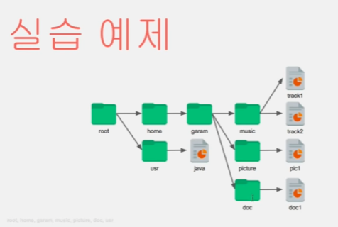

# designpattern

1. Stragtegy Pattern
 - 전략 바꾸기.
 - 인터페이스 
   - 객체 간 연결
   - 기능에 대한 선언과 구현 분리
   - 기능을 통로로 사용
 - 델리게이트
   - 위임하다.
 - 전략 패턴
   - 여러 알고리즘의 하나의 추상적인 접근점을 만들어 접근 점에서 서로 교환 가능하도록 하는 패턴
   - 

2. Adapter Pattern
 - 
 ** 라이브러리 및 기존의 함수를 Adapter 로 감싸서 원하는 결과를 얻을 수 있도록 만들어 본다.

3. Template Pattern
 - 알고리즘의 구조를 메소드에 정의하고, 하위 클래스에서 알고리즘 구조의 변경없이 알고리즘을 재정희하는 패턴
> 알고리즘을 여러 단계로 나누고, 메소드로 선언한다.
> 알고리즘을 수행할 템플릿 메소드를 만든다.
> 하위 클래스에서 나눠진 메소드들을 구현한다.
 - 
 

4. Factory Method Pattern
 - 구조와 구현의 분리를 이해
 - 

5. Singleton Pattern
 - 하나만 생성해야할 객체를 위한 패턴
 - 

6. Prototype Pattern
 - 생산비용이 높은 인스턴스를 복사를 통해 쉽게 생성할 수 있도록 하는 패턴
 - 종류가 너무 많아 클래스로 정리되지 않는 경우
 - 클래스로부터 인스턴스 생성이 어려운 경우
 - 

7. Builder Pattern
 - 복잡한 단계를 거쳐야 생성되는 객체의 구현을 서브 클래스에 넘겨주는 패턴
 - 

8. AbstractFactory 
 - 

9. Bridge Pattern
 - 기능 부분과 구현 부분 분리
 - 

10. Composite Pattern
 - 
 - 